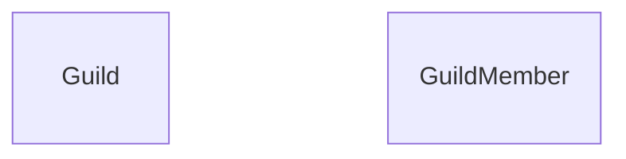
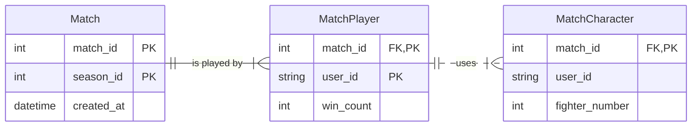
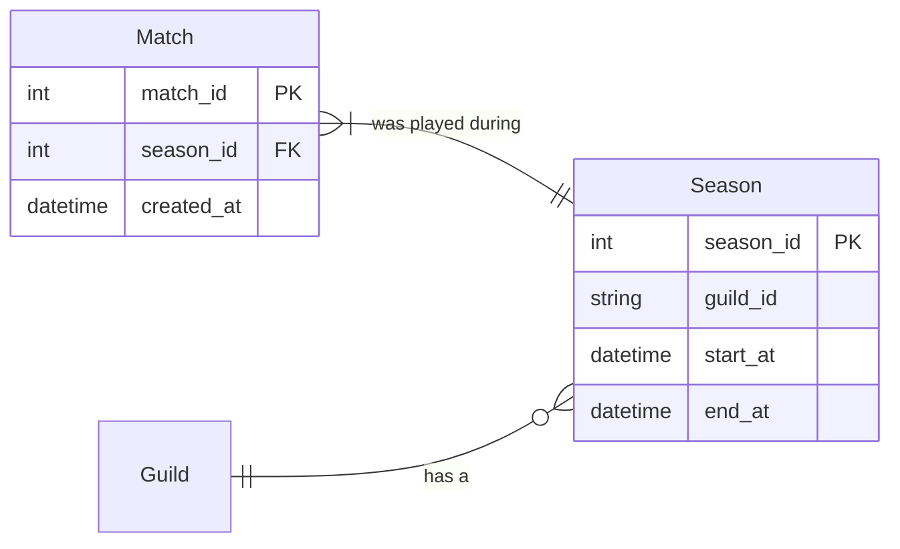
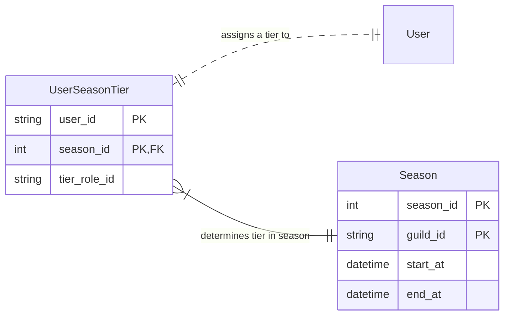

This file outlines the structure of the entities stored by Grindcord, and the rationale in their design. An emphasis is placed on database entities in their role as storage, rather than their function.

In an effort to support compatibility with every database management system (DBMS) supported by Knex.js, we avoid the use of arrays and enums.

Matches are reported to the backend. These reports contain the data:

- The Discord server in which the match was played
- The users who played
- Match count (3-0)
- The fighters used by each respective user

# External Dependencies

A user of Grindcord SHOULD NOT be stored explicitly in our database. A [`GuildMember`](https://discord.com/developers/docs/resources/guild#guild-member-object) is an external dependency provided by Discord. A [`GuildMember`](https://discord.com/developers/docs/resources/guild#guild-member-object)'s `user_id` on the [`user`](https://discord.com/developers/docs/resources/user#user-object) field SHOULD be considered a primary key for our purposes.

A guild SHOULD NOT be stored explicitly in our database. A [`Guild`](https://discord.com/developers/docs/resources/guild#guild-object) is an external dependency provided by Discord. A `Guild`'s `guild_id` SHOULD be considered a primary key for our purposes.

# Matches Played by Users

We split this into three tables.

##### Entity Relation Diagram for Matches, storing the data that would be reported by a user.

The winner of the match SHALL be inferred by selecting the `MatchPlayer` record with the highest `win_count` among records with the same `match_id`.

Note that `guild_id` is not stored by the `Match` table. When a match is reported for a particular `guild_id` (a unique ID assigned by Discord for a particular Discord server), the match is reported for that "guild's" current season (see below).

# Seasons for Guilds

##### Entity Relation Diagram for Seasons.

A guild's "current" season is a `Season` record for which the `guild_id` matches, and the system datetime is between `start_at` and `end_at`.

> Queries for a guild's current season should be optimized by creating an index on a guild.

A `Match` is played in a `Season` if the `season_id` matches a `Season` record's `season_id`. 

In addition, a `Season` in which participants will be designated an individual tier. Participants in a `Season` are `GuildMember`s who report having participated in a `Match` during a `Season`.

# Tiers for Users Playing Matches

> We recommand some in-memory key-value database to store tiers for current seasons. This is not implemented for the current release of Grindcord.

For past seasons, Grindcord SHALL keep a record of each participating user's role.

A `tier_role_id` is the `role_id` of a role in a Discord server.
