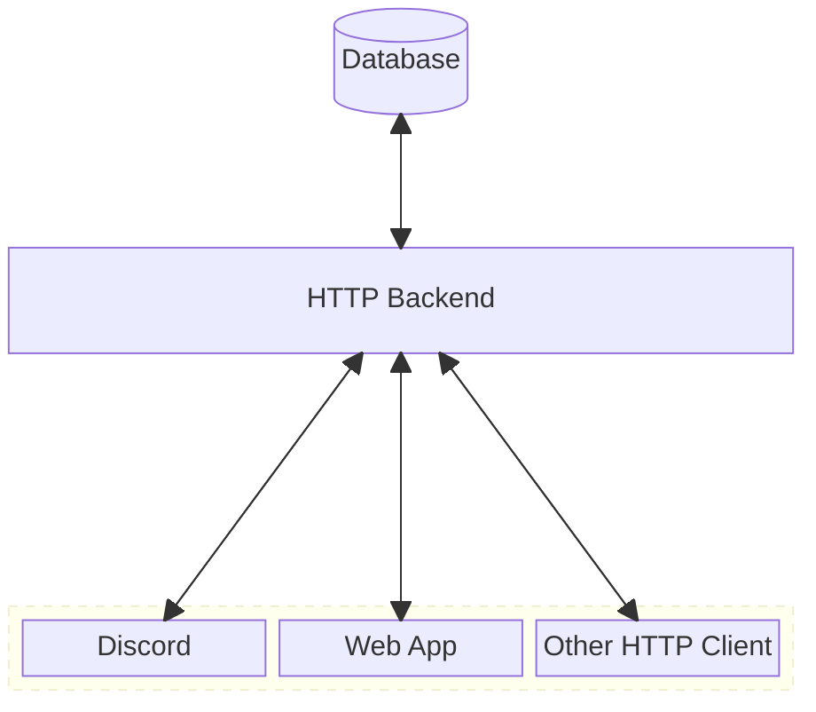

This document describes some of the major internal components of Grindcord and their functionality.

## User Interfaces (Discord, Website)

To communicate with Discord, Grindcord uses the [Gateway API](https://discord.com/developers/docs/reference#gateway-websocket-api) provided by Discord.
Grindcord receives events and commands from the Discord interface.

For a more fluid user experience, a web interface implements all features of the Discord Interface.

## HTTP Backend

For compatibility and extensibility, Grindcord provides a decoupled stateless backend which interfaces primarily with the User Interfaces detailed above, but can interact with any HTTP client.

Multiple backends MAY utilize the same database.

## Database

Grindcord is capable of using most relational database management systems, however, it is developed with SQLite.

We recommend Postgres.

###### Block diagram for Grindcord.
